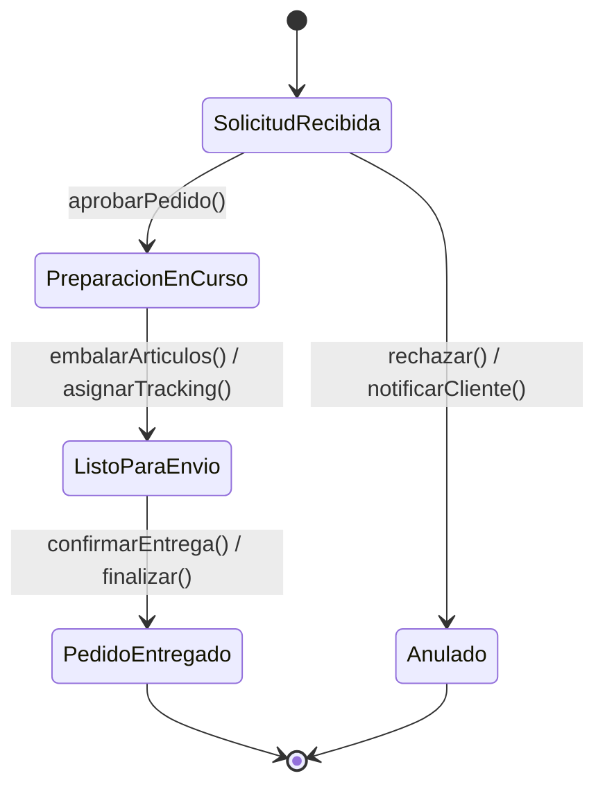
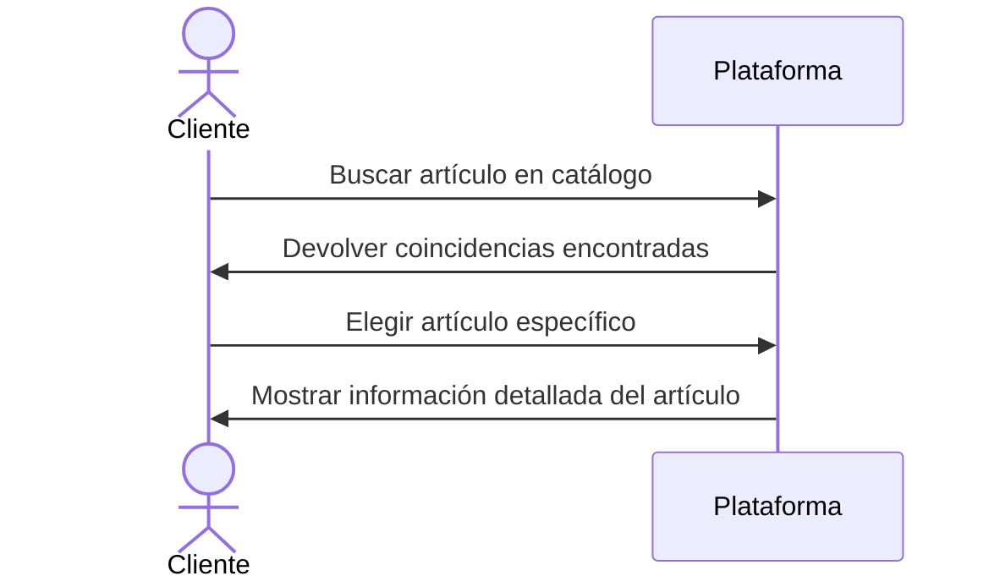
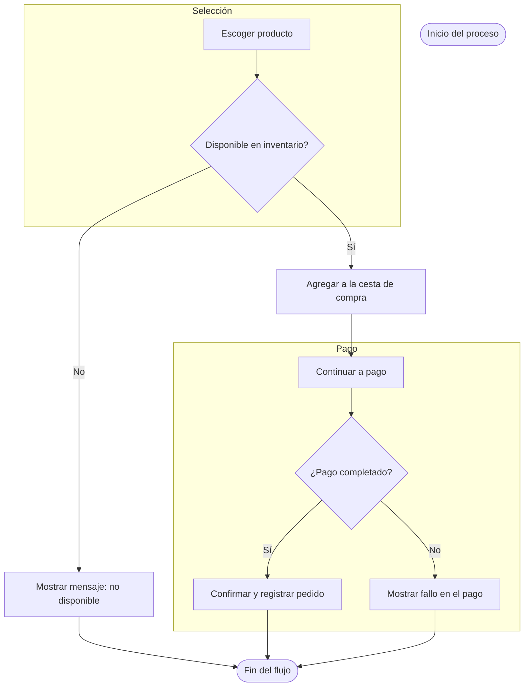

# Plataforma de Administración Centralizada de Inventarios y Almacenes

## Requisitos del Sistema

### Requisitos Funcionales

| **ID** | **Requisito**                                                                                       | **Nivel de Prioridad** | **Origen**             | **Estado**     |
|--------|------------------------------------------------------------------------------------------------------|-------------------------|------------------------|----------------|
| F-01   | Permitir el alta de productos con detalles como código, nombre, medidas, lote y fecha de expiración | Alta                    | Cliente                | Esbozado       |
| F-02   | Gestionar distintos almacenes y sus zonas internas (como estanterías y áreas de picking)            | Media                   | Análisis Funcional     | Esbozado       |
| F-03   | Registrar operaciones de inventario como entradas, traslados, pérdidas y devoluciones                | Alta                    | Cliente                | Esbozado       |
| F-04   | Reflejar existencias en tiempo real y ofrecer un historial de movimientos                           | Alta                    | Cliente                | Esbozado       |
| F-05   | Crear solicitudes de envío para clientes o producción                                                | Media                   | Responsable logístico  | Esbozado       |
| F-06   | Producir listas de recogida con rutas de recolección eficientes                                     | Media                   | Parte interesada       | Esbozado       |
| F-07   | Validar la preparación, empaquetado y envío de productos                                             | Media                   | Cliente                | Esbozado       |
| F-08   | Vincularse con empresas de transporte para etiquetas y tracking                                     | Media                   | Departamento IT        | Esbozado       |
| F-09   | Lanzar alertas si las existencias bajan o superan ciertos límites                                   | Media                   | Cliente                | Esbozado       |
| F-10   | Informar sobre entregas retrasadas, diferencias o fechas próximas de vencimiento                    | Media                   | Política Interna       | Esbozado       |
| F-11   | Programar conteos de inventario regulares                                                            | Baja                    | Cliente                | Esbozado       |
| F-12   | Visualizar paneles con métricas clave: rotación, antigüedad, eficiencia                             | Alta                    | Dirección Operativa    | Esbozado       |
| F-13   | Posibilidad de exportar informes en formatos como PDF o CSV                                         | Media                   | Cliente                | Esbozado       |
| F-14   | Implementar seguridad por roles con autenticación de dos pasos                                      | Alta                    | Departamento IT        | Esbozado       |
| F-15   | Registrar acciones clave del sistema con hora, usuario y actividad                                  | Alta                    | Normativa              | Esbozado       |

### Requisitos No Funcionales

| **ID**  | **Descripción**                                                               | **Categoría**     | **Indicador**                | **Objetivo**              | **Notas**                                 |
|--------|--------------------------------------------------------------------------------|-------------------|------------------------------|---------------------------|-------------------------------------------|
| NF-01  | Las consultas de stock deben responder en menos de 2 segundos                 | Rendimiento       | Tiempo de respuesta          | < 2 seg                   | Probar regularmente bajo carga real       |
| NF-02  | Soportar al menos 500 usuarios conectados a la vez                            | Escalabilidad     | Sesiones simultáneas         | ≥ 500 usuarios            | Usar infraestructura escalable            |
| NF-03  | Cifrado de información crítica con tecnología AES-256                         | Seguridad         | Nivel de cifrado             | Obligatorio               | Cumplir ISO/IEC 27001                     |
| NF-04  | Autenticación reforzada para roles de privilegio                              | Seguridad         | Verificación en dos pasos    | Obligatoria               | Aplicar a perfiles administrativos        |
| NF-05  | Cumplir con el estándar WCAG 2.1 (nivel AA) en la interfaz                    | Usabilidad        | Accesibilidad                | Nivel AA                  | Auditoría externa recomendada             |
| NF-06  | Disponibilidad operativa mínima del 99,5 %                                    | Fiabilidad        | Tiempo en línea              | ≥ 99.5 %                  | Supervisión continua del sistema          |
| NF-07  | Informes mensuales generados en menos de 5 segundos                           | Rendimiento       | Tiempo de generación         | ≤ 5 segundos              | Validar con datos reales                  |
| NF-08  | Arquitectura abierta para conexión con sistemas ERP                           | Interoperabilidad | Compatibilidad con APIs REST | Soporte REST documentado | Usar especificaciones OpenAPI             |

## Casos de Uso

### Tabla Resumen

| **ID** | **Funcionalidad**                | **Usuario**              | **Requisito Previo**                          | **Procedimiento Principal**                                                                                   | **Variantes**                                                       | **Resultado Final**                                 |
|--------|----------------------------------|--------------------------|-----------------------------------------------|---------------------------------------------------------------------------------------------------------------|----------------------------------------------------------------------|------------------------------------------------------|
| CU-01  | Alta de producto                 | Encargado de almacén     | Usuario autenticado                           | Accede al formulario → ingresa datos → envía → sistema valida y almacena                                     | Datos erróneos: muestra aviso                                       | Producto registrado                                   |
| CU-02  | Modificación de stock            | Gestor de inventario     | Producto registrado                           | Selecciona producto → elige operación → ingresa cantidades → confirma                                        | Stock negativo: rechazo del ajuste                                  | Stock actualizado                                    |
| CU-03  | Solicitar envío                  | Área logística           | Producto disponible                           | Elige artículos y cantidades → destino → confirma                        | Stock insuficiente: mostrar aviso                                   | Orden creada y en espera                             |
| CU-04  | Optimizar picking                | Sistema                  | Orden registrada                               | Agrupa productos → ordena recorrido → genera documento                   | —                                                                    | Lista optimizada generada                          |
| CU-05  | Confirmar preparación            | Personal de almacén      | Picking realizado                              | Escanea artículos → empaqueta → marca como enviado                       | Producto faltante: aviso al encargado                              | Pedido marcado como despachado                      |
| CU-06  | Ver stock actual                 | Usuario general          | Sesión iniciada                               | Accede al panel → ve información actualizada                             | —                                                                    | Visualización completada                            |
| CU-07  | Alertas de inventario            | Sistema                  | Umbral alcanzado                              | Detecta variación → emite alerta y la comunica                           | —                                                                    | Alerta enviada                                      |
| CU-08  | Crear informe                    | Usuario                  | Datos disponibles                             | Establece filtros → selecciona tipo → exporta resultado                  | —                                                                    | Informe generado                                    |
| CU-09  | Gestionar roles y accesos        | Administrador            | Cuenta con permisos avanzados                 | Ingresa al panel → define permisos → guarda configuración                | —                                                                    | Configuración actualizada                          |
| CU-10  | Integración con transportistas   | Sistema                  | Pedido empaquetado                            | Crea etiqueta → llama API del operador logístico → recibe tracking       | Fallo API: notificar error                                          | Envío con seguimiento                              |
| CU-11  | Inventario cíclico               | Encargado de conteo      | Producto preparado para auditoría             | Escanea producto → introduce conteo real → sistema registra o reporta    | Error de lectura: repetir acción                                    | Stock ajustado o marcado                            |
| CU-12  | Visualizar métricas              | Supervisor                | Información histórica registrada              | Accede al panel → visualiza KPIs                                         | —                                                                    | Métricas disponibles para análisis                  |
| CU-13  | Registro de acciones             | Auditor                   | Se han realizado operaciones críticas         | Filtra por usuario, fecha o tipo de acción → revisa los detalles         | —                                                                    | Auditoría lista y consultable                      |

## Objetivos del Proyecto (SMART)

| **ID**   | **Meta**                                                                      | **Clasificación** | **Indicador**                    | **Fecha Límite** | **Encargado**            | **Estado**       |
|----------|-------------------------------------------------------------------------------|-------------------|----------------------------------|------------------|---------------------------|------------------|
| OBJ-01   | Digitalizar completamente entradas y salidas de mercancía                    | Estratégico       | % de procesos digitalizados      | 2025-05-13       | Dirección del Proyecto    | En desarrollo    |
| OBJ-02   | Disminuir errores de inventario en un 25 %                                   | Táctico           | Porcentaje de reducción          | 2025-05-13       | Área Técnica              | Pendiente        |
| OBJ-03   | Mantener disponibilidad mensual superior al 99 %                             | Operacional       | % de uptime                      | 2025-05-13       | Equipo DevOps             | Pendiente        |
| OBJ-04   | Reducir el tiempo de registro de productos a menos de 2 min                  | Operacional       | Tiempo medio (min)               | 2025-05-13       | Backend                   | En proceso       |
| OBJ-05   | Implementar sistema de alertas en tiempo real                                | Táctico           | Funcionalidad en producción      | 2025-05-13       | Área Técnica              | En desarrollo    |
| OBJ-06   | Mejorar eficiencia en picking un 30 % con rutas optimizadas                  | Estratégico       | % de mejora                      | 2025-05-13       | Logística / IT            | Pendiente        |
| OBJ-07   | Capacitar al 100 % del personal en el sistema en 1 mes                       | Operacional       | % de empleados capacitados       | 2025-05-13       | RRHH                      | Pendiente        |
| OBJ-08   | Integrar al menos 3 operadores logísticos                                    | Táctico           | Nº de integraciones              | 2025-05-13       | Área de Integraciones     | Pendiente        |
| OBJ-09   | Obtener una valoración ≥ 4 sobre 5 en satisfacción tras la implementación    | Estratégico       | Puntuación media de encuestas    | 2025-05-13       | UX / Atención al Cliente  | Pendiente        |
| OBJ-10   | Auditar la totalidad de acciones críticas del sistema                        | Operacional       | % de acciones trazadas           | 2025-05-13       | Auditoría / Seguridad     | Pendiente        |

## Trazabilidad de Requisitos

| **Req ID** | **Descripción del Requisito**              | **Objetivo Relacionado** | **Caso de Uso**                     | **Prueba Asociada**          |
|-----------|---------------------------------------------|---------------------------|-------------------------------------|-------------------------------|
| F-01      | Alta de productos                           | OBJ-01                    | CU-01: Alta producto                | TP-01                        |
| F-02      | Ajustes de inventario                       | OBJ-01, OBJ-02            | CU-02: Modificar stock              | TP-02                        |
| F-03      | Crear orden de salida                       | OBJ-01                    | CU-03: Solicitar envío              | TP-03                        |
| F-04      | Generar listas optimizadas                  | OBJ-03                    | CU-04: Picking                      | TP-04                        |
| F-05      | Confirmar envío                             | OBJ-01                    | CU-05: Confirmación envío           | TP-05                        |
| F-06      | Visualización de stock                      | OBJ-01, OBJ-02            | CU-06: Ver existencias              | TP-06                        |
| F-07      | Alertas automáticas                         | OBJ-02                    | CU-07: Avisos inventario            | TP-07                        |
| F-08      | Informes exportables                        | OBJ-04                    | CU-08: Crear informe                | TP-08                        |
| F-09      | Gestión de usuarios                         | OBJ-05                    | CU-09: Configuración roles          | TP-09                        |
| F-10      | Integración logística externa               | OBJ-03                    | CU-10: Integración con operadores   | TP-10                        |
| F-11      | Auditoría mediante conteo                   | OBJ-01                    | CU-11: Inventario cíclico           | TP-11                        |
| F-12      | KPIs y paneles de control                   | OBJ-04                    | CU-12: Visualizar métricas          | TP-12                        |
| F-13      | Registro de acciones                        | OBJ-05                    | CU-13: Auditoría                    | TP-13                        |
| NF-01     | Tiempo de respuesta óptimo                  | OBJ-03                    | Optimización de consultas           | TP-14                        |
| NF-02     | Adaptabilidad de la interfaz                | OBJ-03                    | UI responsive                       | TP-15                        |
| NF-03     | Protección de información                   | OBJ-05                    | TLS + AES                           | TP-16                        |
| NF-04     | Alta disponibilidad                         | OBJ-03                    | Arquitectura redundante             | TP-17                        |

# Requisitos Funcionales

### Tabla Detallada

| **ID**   | **Descripción**                                                                                          | **Prioridad** | **Fuente**              | **Estado**   |
|----------|----------------------------------------------------------------------------------------------------------|---------------|--------------------------|--------------|
| RF-01    | Registrar productos con datos como código, descripción, dimensiones, lote y fecha de caducidad.         | Alta          | Cliente                  | Propuesto    |
| RF-02    | Administrar múltiples almacenes y sus ubicaciones internas (pasillos, estanterías, zonas de picking).     | Media         | Analista Funcional       | Propuesto    |
| RF-03    | Ajustar inventario (entradas, traslados, pérdidas, devoluciones).                                         | Alta          | Cliente                  | Propuesto    |
| RF-04    | Visualizar niveles de stock en tiempo real y su historial de movimientos.                                | Alta          | Cliente                  | Propuesto    |
| RF-05    | Crear órdenes de salida para clientes o procesos de producción.                                           | Media         | Responsable Logístico    | Propuesto    |
| RF-06    | Generar listados de picking con rutas de recolección optimizadas.                                        | Media         | Stakeholder Interno      | Propuesto    |
| RF-07    | Confirmar la preparación, embalaje y expedición de pedidos.                                              | Media         | Cliente                  | Propuesto    |
| RF-08    | Integración con transportistas para generar etiquetas y seguimiento.                                     | Media         | Cliente                  | Propuesto    |
| RF-09    | Notificar automáticamente al alcanzar umbrales mínimos o máximos de stock.                                | Alta          | Responsable de Inventario| Propuesto    |
| RF-10    | Alertar por email o interfaz sobre entregas tardías, discrepancias o productos por caducar.              | Alta          | Cliente                  | Propuesto    |
| RF-11    | Programar recuentos cíclicos regulares del inventario.                                                    | Media         | Analista Funcional       | Propuesto    |
| RF-12    | Mostrar dashboards de inventario con métricas como rotación y antigüedad.                                | Media         | Cliente                  | Propuesto    |
| RF-13    | Generar reportes personalizables en formatos CSV y PDF.                                                   | Media         | Stakeholder Interno      | Propuesto    |
| RF-14    | Mostrar KPIs sobre eficiencia y costes logísticos.                                                       | Media         | Analista de Negocio      | Propuesto    |
| RF-15    | Control de acceso por rol, autenticación de dos factores y registro de auditoría.                        | Alta          | Normativa Interna        | Propuesto    |

# Requisitos No Funcionales

### Tabla Detallada

| **ID**    | **Descripción**                                                      | **Categoría**    | **Métrica**                  | **Objetivo**         | **Comentarios**                                       |
|-----------|----------------------------------------------------------------------|------------------|------------------------------|----------------------|-------------------------------------------------------|
| RNF-01    | Tiempo máximo de respuesta en consultas de inventario.              | Rendimiento      | Tiempo de respuesta          | < 2 segundos         | Probar regularmente con cargas simuladas.             |
| RNF-02    | Capacidad para al menos 1.000 usuarios activos al mismo tiempo.     | Escalabilidad    | Usuarios simultáneos         | ≥ 1.000 usuarios     | Considerar escalabilidad horizontal en diseño.        |
| RNF-03    | Cifrado de datos confidenciales en tránsito y reposo (AES-256).     | Seguridad        | Algoritmo aplicado           | Obligatorio          | Cumple con ISO 27001 / GDPR.                          |
| RNF-04    | Cumplimiento de WCAG 2.1 (AA) para la interfaz del sistema.         | Usabilidad       | Auditoría de accesibilidad   | Nivel AA             | Recomendada validación externa previa al despliegue.  |
| RNF-05    | Registro exhaustivo de eventos críticos para trazabilidad total.    | Mantenibilidad   | Eventos registrados          | 100 % trazabilidad   | Verificar regularmente integridad del registro.       |

# Casos de Uso (Resumen)

### Tabla Principal

| **ID**   | **Nombre**                        | **Actor(es)**               | **Precondición**                                | **Flujo Principal**                                      | **Flujos Alternativos**                            | **Postcondición**                                      |
|----------|-----------------------------------|-----------------------------|--------------------------------------------------|----------------------------------------------------------|----------------------------------------------------|--------------------------------------------------------|
| CU-01   | Registrar producto                | Gestor de almacén           | Usuario autenticado                             | Llenado de formulario y envío                           | Datos inválidos → errores mostrados                | Producto registrado                                   |
| CU-02   | Ajustar inventario                | Gestor de almacén           | Producto existente                               | Selección, tipo de ajuste, cantidad, confirmación       | Inventario negativo → ajuste rechazado             | Inventario actualizado                                |
| CU-03   | Crear orden de salida             | Responsable de logística     | Stock suficiente                                 | Selección de productos, definición de destino, confirmación | Stock insuficiente → alerta                        | Orden generada y lista para preparar                 |
| CU-04   | Generar listado de picking        | Sistema                     | Orden de salida creada                           | Agrupación por ubicación, orden secuencial, generación  | —                                                  | Lista optimizada generada                           |
| CU-05   | Confirmar preparación y envío     | Operario de almacén         | Picking terminado                                | Escaneo, empaquetado, marcado como enviado              | Faltante → aviso al supervisor                      | Pedido marcado como enviado                         |
| CU-06   | Visualizar stock                  | Usuario                     | Usuario autenticado                             | Ingreso al panel y visualización                        | —                                                  | Usuario informado sobre stock                        |
| CU-07   | Notificar alerta de stock         | Sistema                     | Umbral de stock alcanzado                        | Detección, generación de alerta, envío                  | —                                                  | Alerta enviada y registrada                          |
| CU-08   | Crear informe                     | Usuario                     | Datos disponibles                                | Definición de filtros, generación, exportación          | —                                                  | Informe generado en CSV/PDF                          |
| CU-09   | Gestionar acceso de usuarios      | Administrador               | Cuenta con permisos                              | Configuración de roles y privilegios                    | —                                                  | Accesos actualizados                                 |
| CU-10   | Integrar con transportistas       | Sistema                     | Pedido listo                                     | Generar etiqueta, consumir API, recibir seguimiento     | Fallo en API → reintento o alerta                  | Envío registrado con seguimiento                     |
| CU-11   | Realizar recuento cíclico         | Inventarista                | Producto escaneable                              | Escaneo, ingreso real, ajuste o registro de discrepancia| Error escaneo → repetir                             | Stock actualizado o pendiente de revisión           |
| CU-12   | Consultar dashboard               | Supervisor                   | Datos actualizados                               | Ingreso al panel, visualización de KPIs                | —                                                  | Supervisión en tiempo real                           |
| CU-13   | Auditar acciones del sistema      | Auditor                      | Acciones críticas realizadas                     | Filtro por fecha/acción/usuario y consulta              | —                                                  | Acciones registradas y trazables                    |

# Matriz de Trazabilidad

| **Req. ID** | **Descripción del Requisito**                      | **Objetivo(s)**         | **Caso de Uso / Diseño**            | **Caso de Prueba**              |
|-------------|----------------------------------------------------|-------------------------|-------------------------------------|---------------------------------|
| RF-01       | Registro de productos                              | OBJ-01                  | CU-01                               | TP-01                           |
| RF-02       | Ajustes de inventario                              | OBJ-01, OBJ-02          | CU-02                               | TP-02                           |
| RF-03       | Generar órdenes de salida                          | OBJ-01                  | CU-03                               | TP-03                           |
| RF-04       | Picking optimizado                                 | OBJ-03                  | CU-04                               | TP-04                           |
| RF-05       | Confirmación de preparación y envío                | OBJ-01                  | CU-05                               | TP-05                           |
| RF-06       | Visualización de stock                             | OBJ-01, OBJ-02          | CU-06                               | TP-06                           |
| RF-07       | Alertas automáticas                                | OBJ-02                  | CU-07                               | TP-07                           |
| RF-08       | Creación de informes                               | OBJ-04                  | CU-08                               | TP-08                           |
| RF-09       | Gestión de usuarios y accesos                      | OBJ-05                  | CU-09                               | TP-09                           |
| RF-10       | Integración con transportistas                     | OBJ-03                  | CU-10                               | TP-10                           |
| RF-11       | Inventario cíclico                                 | OBJ-01                  | CU-11                               | TP-11                           |
| RF-12       | Dashboard con métricas                             | OBJ-04                  | CU-12                               | TP-12                           |
| RF-13       | Auditoría de acciones                              | OBJ-05                  | CU-13                               | TP-13                           |
| RNF-01      | Tiempo de respuesta óptimo                         | OBJ-03                  | Optimización de consultas           | TP-14                           |
| RNF-02      | Interfaz accesible y responsive                    | OBJ-03                  | Diseño UI adaptable                 | TP-15                           |
| RNF-03      | Cifrado de datos sensibles                         | OBJ-05                  | Seguridad: TLS + AES                | TP-16                           |
| RNF-04      | Alta disponibilidad del sistema                    | OBJ-03                  | Arquitectura con redundancia        | TP-17                           |

